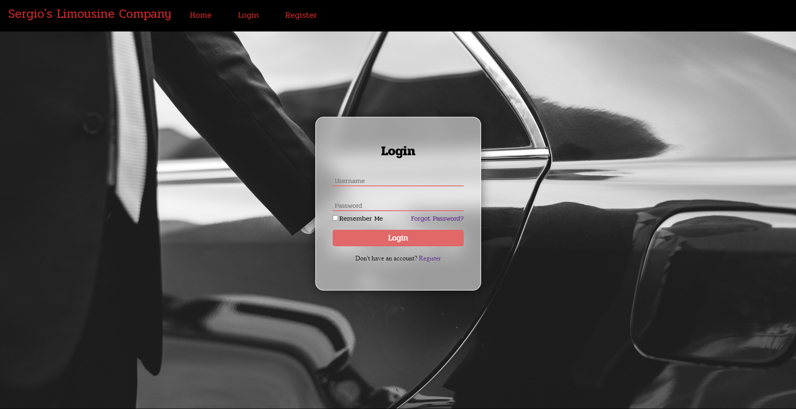
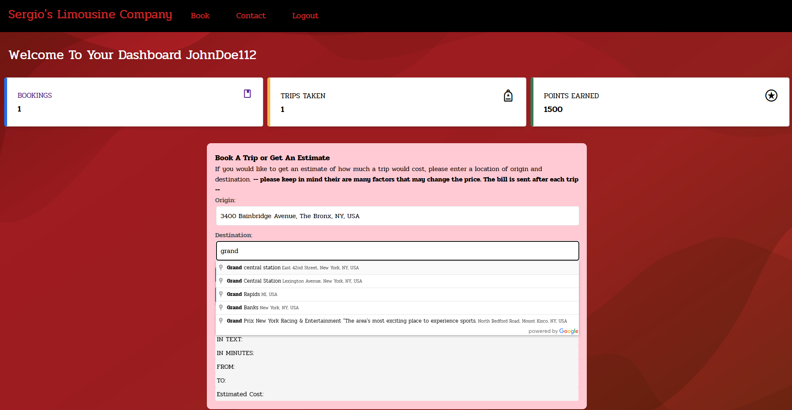
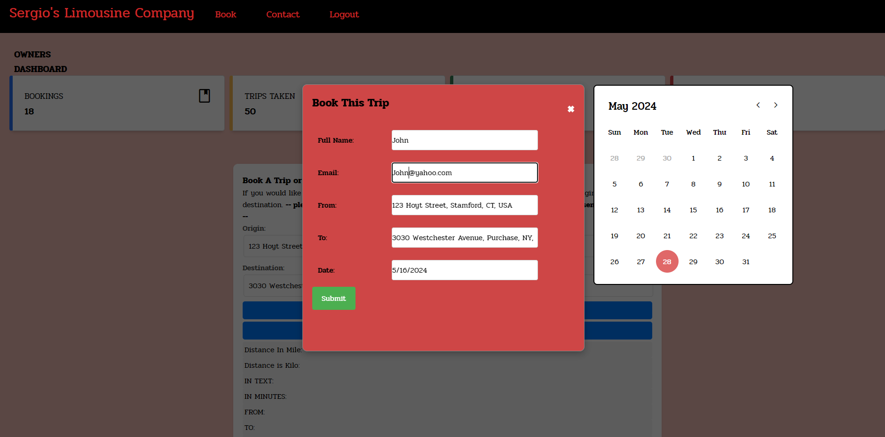

# Limo Booking Web Application(in Progress)

## Table of Contents
- [Overview](#overview)
- [Features](#features)
- [Demo](#demo)
- [Screenshots](#screenshots)
- [Learnings](#learnings)
- [Installation](#installation)
- [Prerequisites](#prerequisites)
- [License](#license)


## Overview
The Limo Booking Web Application is a comprehensive platform that allows users to book limo services, calculate distances, and estimate costs in real-time. The application is built using **Flask, SQLAlchemy, and integrates Google Maps API** for location and distance functionalities.


## Features
- User authentication and authorization
- Real-time distance calculation and cost estimation using Google Maps API
- Responsive and user-friendly interface with HTML, CSS, Bootstrap
- Secure password hashing with Bcrypt
- Robust form handling and validation with Flask-WTF
- Dynamic data updates with JavaScript and jQuery

## Demo
[Demo coming soon](#)

## Screenshots






## Learnings:

Google Maps API Integration:
- Connected and configured Google Maps API for location-based functionalities.
- Utilized JavaScript for dynamic map updates and location selection.

### Flask Framework:
- Built the backend with Flask, handling form submissions and data processing securely.
- Integrated Flask-Login for user authentication and session management.

### Frontend Development:
- Designed and implemented a responsive UI with HTML, CSS, and JavaScript.
- Utilized Flask-WTF for form handling and validation.

## Issues and Resolutions:
### Data Duplication on Page Reload:
- Resolution: Managed form submissions to prevent unintended database entries.

### User Data Access Control:
- Resolution: Implemented user-specific data filtering to ensure data privacy.

### Styling and Layout:
- Resolution: Enhanced CSS skills to fix visibility issues and improve overall design.

## Installation

### Prerequisites
Before you begin, ensure you have the following installed:
```bash
- pip install Flask
- pip install Flask-SQLAlchemy
- pip install Flask-Login
- pip install Flask-WTF
- pip install WTForms
- pip install Flask-Bcrypt
- pip install requests
- pip install email-validator
```
### Clone the Repository
```bash
git clone https://github.com/yourusername/limo-booking-app.git
cd limo-booking-app
```
### License
MIT License

Copyright (c) 2024 Joaquin C

Permission is hereby granted, free of charge, to any person obtaining a copy
of this software and associated documentation files (the "Software"), to deal
in the Software without restriction, including without limitation the rights
to use, copy, modify, merge, publish, distribute, sublicense, and/or sell
copies of the Software, and to permit persons to whom the Software is
furnished to do so, subject to the following conditions:

The above copyright notice and this permission notice shall be included in all
copies or substantial portions of the Software.

THE SOFTWARE IS PROVIDED "AS IS", WITHOUT WARRANTY OF ANY KIND, EXPRESS OR
IMPLIED, INCLUDING BUT NOT LIMITED TO THE WARRANTIES OF MERCHANTABILITY,
FITNESS FOR A PARTICULAR PURPOSE AND NONINFRINGEMENT. IN NO EVENT SHALL THE
AUTHORS OR COPYRIGHT HOLDERS BE LIABLE FOR ANY CLAIM, DAMAGES OR OTHER
LIABILITY, WHETHER IN AN ACTION OF CONTRACT, TORT OR OTHERWISE, ARISING FROM,
OUT OF OR IN CONNECTION WITH THE SOFTWARE OR THE USE OR OTHER DEALINGS IN THE
SOFTWARE.
